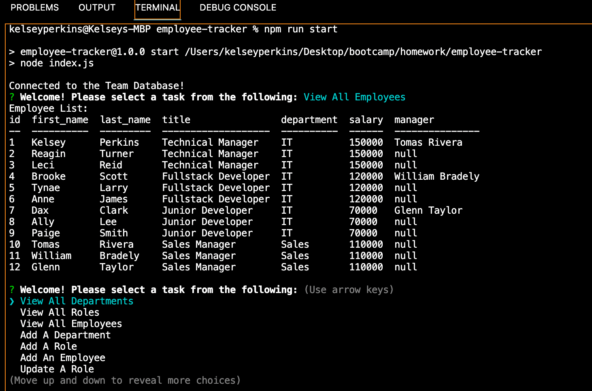

# employee-tracker

## Description
A command-line application that manages your company's employee database while implementing Node.js, Inquirer, and MySQL.

## Table of Contents
- [Installation](#installation)
- [Usage](#usage)
- [Video](#video)
- [Credits](#credits)
- [License](#license)

## Installation:
run the following command in your terminal: npm i 

## Usage:
run the following command in your terminal: node index.js

## Video:
- <a href="https://youtu.be/f72CDP2ogt8">Click Here: Video Link</a>

## Contributing:
  None 

# License:
 The repo is licensed by: MIT 

# Questions:
Have questions? Email me!: kelseykodes@yahoo.com 
